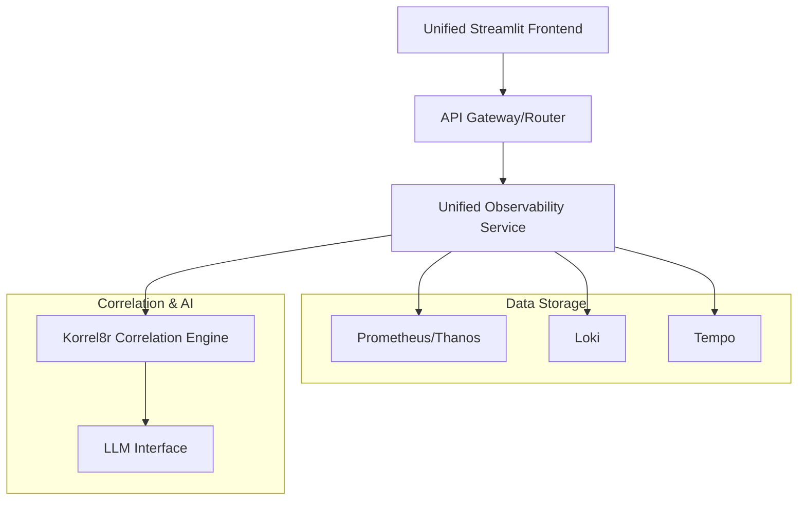

# AI-Powered Unified Observability Platform Enhancement Proposal

## Summary

This proposal outlines the enhancement of the existing AI Observability Metrics Summarizer to create a unified observability platform
that integrates **metrics (Prometheus)**, **logging (Loki and/or cluster-logging-operator)**, and **distributed tracing (Tempo)** with AI-powered analysis and correlation capabilities.

The enhanced platform will provide end-to-end observability for AI/ML workloads running on OpenShift AI, enabling teams to understand system behavior
across all three pillars of observability through natural language interactions and intelligent correlation analysis.

## Current State

### Existing Capabilities
- ✅ **Metrics Collection**: vLLM metrics via Prometheus
- ✅ **AI Analysis**: LLM powered metric summarization and anomaly detection  
- ✅ **Interactive Chat**: Natural language querying of metrics data
- ✅ **Multi-tenant**: Namespace-aware deployment with OpenShift integration
- ✅ **Modern Architecture**: FastAPI backend + Streamlit frontend with Helm deployment

### Current Limitations
- ❌ **Metrics Only**: No access to logs or distributed traces
- ❌ **Limited Context**: Cannot correlate performance issues across observability signals
- ❌ **Reactive Analysis**: No proactive alerting or continuous monitoring
- ❌ **Single Data Source**: Prometheus-only data limits troubleshooting effectiveness

## Proposed Enhanced Architecture

### Core Components



### Enhanced Service Architecture

#### 1. **Unified Frontend (Enhanced Streamlit UI)**
```python
# New multi-tab interface structure
tabs = ["📈 Metrics", "📝 Logs", "🔍 Traces", "🔄 Correlation", "🤖 AI Assistant"]

# Unified time range and namespace selection
time_range = st.sidebar.date_input("Time Range")
namespace = st.sidebar.selectbox("Namespace", get_namespaces())
service = st.sidebar.selectbox("Service", get_services())
```

#### 2. **Unified Observability Service**
```python
class UnifiedObservabilityService:
    def __init__(self):
        # Data source clients
        self.prometheus = PrometheusClient()
        self.loki = LokiClient()
        self.tempo = TempoClient()
        
        # Correlation and analysis engines
        self.korrel8r = Korrel8rClient()     # Purpose-built correlation engine
        self.llm_interface = LLMInterface()  # Natural language processing
    
    async def analyze_observability_query(self, query: ObservabilityQuery):
        """Single entry point for all observability analysis"""
        
        # Use Korrel8r for cross-signal correlation
        correlations = await self.korrel8r.correlate_signals(
            start_signal=query.start_point,
            goal_types=["logs", "traces", "metrics"],
            time_range=query.time_range,
            namespace=query.namespace
        )
        
        # Use LLM for natural language insights and summarization
        return await self.llm_interface.generate_insights(
            correlations, query.natural_language_query
        )
    
    async def get_metrics(self, namespace: str, time_range: str):
        """Direct metrics access (legacy compatibility)"""
        return await self.prometheus.fetch_metrics(namespace, time_range)
    
    async def get_logs(self, namespace: str, query: str, time_range: str):
        """Direct logs access"""
        return await self.loki.fetch_logs(namespace, query, time_range)
    
    async def get_traces(self, service: str, time_range: str):
        """Direct traces access"""
        return await self.tempo.fetch_traces(service, time_range)
```

#### 3. **Korrel8r Integration Layer**
[Korrel8r](https://github.com/korrel8r/korrel8r) is a Kubernetes-native observability correlation engine that provides rule-based correlation across metrics, logs, traces, and cluster resources.

```python
class Korrel8rClient:
    def __init__(self, korrel8r_url: str):
        self.base_url = korrel8r_url
        self.session = aiohttp.ClientSession()
    
    async def correlate_signals(self, start_signal, goal_types, time_range, namespace):
        # Query Korrel8r for signal correlations
        correlation_request = {
            "start": start_signal,
            "goals": goal_types,
            "time_range": time_range,
            "namespace": namespace
        }
        
        # Get correlation graph from Korrel8r
        correlation_graph = await self._query_korrel8r(correlation_request)
        
        # Extract related signals and their relationships
        return self._parse_correlation_results(correlation_graph)
    
    async def _query_korrel8r(self, request):
        # Interface with Korrel8r REST API
        async with self.session.post(
            f"{self.base_url}/api/v1alpha1/correlate", 
            json=request
        ) as response:
            return await response.json()
```

## Technical Implementation Plan

### Logging Integration

#### Loki Data Source Integration
```python
# New service: logs_service.py
class LokiClient:
    def __init__(self, loki_url: str, token: str):
        self.base_url = loki_url
        self.headers = {"Authorization": f"Bearer {token}"}
    
    async def query_logs(self, query: str, start: int, end: int, namespace: str):
        logql = f'{{namespace="{namespace}"}} |= "{query}"'
        # Implementation details...
```

#### Log Analysis Capabilities
- **Error Detection**: Automatic error/exception identification
- **Pattern Recognition**: Common log patterns and anomalies  
- **Performance Correlation**: Link log events to metric spikes
- **Natural Language Querying**: "Show me errors in the last hour"

#### Enhanced UI Components
```python
# New logs tab in Streamlit
def render_logs_tab():
    st.header("📝 Logs Analysis")
    
    # Log search interface
    search_query = st.text_input("Search logs", placeholder="ERROR, exception, timeout...")
    log_level = st.selectbox("Log Level", ["ALL", "ERROR", "WARN", "INFO", "DEBUG"])
    
    # Display logs with syntax highlighting
    if st.button("Search Logs"):
        logs = fetch_logs(search_query, log_level, start_time, end_time)
        display_logs_with_context(logs)
```

### Distributed Tracing Integration

#### Tempo Data Source Integration
```python
# New service: traces_service.py
class TempoClient:
    def __init__(self, tempo_url: str):
        self.base_url = tempo_url
    
    async def search_traces(self, service: str, start: int, end: int):
        # TraceQL queries for vLLM traces
        traceql = f'{{.service.name="{service}"}}'
        # Implementation details...
    
    async def get_trace_by_id(self, trace_id: str):
        # Fetch full trace details
        pass
```

#### Trace Analysis Features
- **Latency Analysis**: E2E request latency breakdown
- **Dependency Mapping**: Service interaction visualization
- **Error Propagation**: How errors flow through services
- **Performance Bottlenecks**: Slow span identification

#### Trace Visualization
```python
# Interactive trace timeline
def render_trace_flamegraph(trace_data):
    # Plotly-based flamegraph visualization
    fig = create_flamegraph(trace_data)
    st.plotly_chart(fig, use_container_width=True)
```

### Korrel8r Integration & AI Analysis

#### Korrel8r Correlation Integration
```python
# This is now integrated into the UnifiedObservabilityService above
# Example of incident analysis using the unified service:

async def analyze_incident_example():
    service = UnifiedObservabilityService()
    
    # Create observability query from alert/incident
    query = ObservabilityQuery(
        start_point=alert_or_incident,
        goal_types=["logs", "traces", "metrics", "k8s_resources"],
        correlation_depth=3,
        time_range="-1h",
        namespace="production",
        natural_language_query="What caused this alert and how can we fix it?"
    )
    
    # Single call handles all correlation and analysis
    analysis_result = await service.analyze_observability_query(query)
    
    return {
        "correlations": analysis_result.correlation_graph,
        "insights": analysis_result.insights,
        "recommendations": analysis_result.recommendations,
        "related_data": {
            "logs": analysis_result.related_logs,
            "traces": analysis_result.related_traces,
            "metrics": analysis_result.related_metrics
        }
    }
```

#### LLM Interface
```python
class LLMInterface:
    def __init__(self, model_endpoint: str):
        self.model_endpoint = model_endpoint
    
    async def analyze_correlations(self, correlation_graph, logs, traces, metrics):
        # Build context from Korrel8r correlation results
        correlation_summary = self._summarize_correlations(correlation_graph)
        
        prompt = f"""
        You are an observability expert analyzing correlated system signals.
        
        KORREL8R CORRELATION RESULTS:
        {correlation_summary}
        
        RELATED LOGS:
        {self._summarize_logs(logs)}
        
        RELATED TRACES:
        {self._summarize_traces(traces)}
        
        RELATED METRICS:
        {self._summarize_metrics(metrics)}
        
        Based on these proven correlations, provide:
        1. Root cause analysis
        2. Impact assessment
        3. Actionable recommendations
        4. Preventive measures
        """
        
        return await self._query_llm(prompt)
    
    def _summarize_correlations(self, graph):
        # Convert Korrel8r graph to human-readable summary
        relationships = []
        for edge in graph.edges:
            relationships.append(f"{edge.source} → {edge.target} ({edge.rule})")
        return "\n".join(relationships)
```

#### Korrel8r-Based Intelligent Monitoring
```python
class IntelligentMonitoring:
    def __init__(self):
        self.observability_service = UnifiedObservabilityService()
        self.alert_manager = AlertManagerClient()
    
    async def continuous_correlation_analysis(self):
        while True:
            # Get active alerts from AlertManager
            active_alerts = await self.alert_manager.get_active_alerts()
            
            for alert in active_alerts:
                # Use unified service for correlation analysis
                query = ObservabilityQuery(
                    start_point=alert,
                    goal_types=["logs", "traces", "metrics"],
                    time_range="-10m",
                    natural_language_query="Analyze this alert and provide context"
                )
                
                analysis = await self.observability_service.analyze_observability_query(query)
                
                # Only send enriched alerts if significant correlations found
                if analysis.has_significant_correlations():
                    await self.send_enriched_alert({
                        "original_alert": alert,
                        "correlation_context": analysis.insights,
                        "related_signals": analysis.correlation_graph
                    })
            
            await asyncio.sleep(60)  # Check every minute
```


## Deployment Strategy

### Enhanced Helm Chart Structure
```yaml
# Unified observability platform structure
charts/
├── unified-observability/
│   ├── Chart.yaml
│   ├── values.yaml
│   ├── templates/
│   │   ├── observability-service/
│   │   │   ├── deployment.yaml
│   │   │   ├── service.yaml
│   │   │   └── configmap.yaml
│   │   ├── ui/
│   │   │   ├── deployment.yaml
│   │   │   ├── service.yaml
│   │   │   └── ingress.yaml
│   │   ├── llm-interface/
│   │   │   ├── deployment.yaml
│   │   │   ├── service.yaml
│   │   │   └── configmap.yaml
│   │   
│   │   ├── korrel8r/
│   │   │   ├── deployment.yaml              # Only if korrel8r.embedded=true
│   │   │   ├── service.yaml
│   │   │   ├── configmap.yaml
│   │   │   └── rbac.yaml                    # ServiceAccount, Role, RoleBinding
│   │   
│   │   # Shared Resources
│   │   ├── rbac/
│   │   │   ├── serviceaccount.yaml
│   │   │   ├── clusterrole.yaml
│   │   │   └── clusterrolebinding.yaml
│   │   └── secrets/
│   │       └── observability-secrets.yaml
│   
│   # Data Stack Dependencies
│   └── charts/
│       ├── loki-stack/                       # Optional: if loki.embedded=true
│       ├── tempo/                            # Optional: if tempo.embedded=true  
│       └── prometheus-stack/                 # Optional: if prometheus.embedded=true
```

### Configuration Management
```yaml
# values.yaml
global:
  namespace: "ai-observability"
  imageRegistry: "quay.io/your-org"
  imagePullPolicy: "IfNotPresent"

observabilityService:
  enabled: true
  image:
    repository: "unified-observability-service"
    tag: "latest"
  replicas: 2
  resources:
    requests:
      cpu: "500m"
      memory: "1Gi"
    limits:
      cpu: "2"
      memory: "4Gi"

ui:
  enabled: true
  image:
    repository: "observability-ui"
    tag: "latest"
  service:
    type: "ClusterIP"
    port: 8501
  ingress:
    enabled: true
    host: "observability.apps.cluster.example.com"

llmInterface:
  enabled: true
  endpoint: "${LLM_ENDPOINT}"  # External LLM service
  maxTokens: 4096
  timeout: 30

# Data Sources Configuration  
dataSources:
  prometheus:
    # External Prometheus
    external:
      enabled: true
      url: "https://prometheus.monitoring.svc.cluster.local:9090"
      token: "${PROMETHEUS_TOKEN}"
    # Embedded option
    embedded:
      enabled: false
  
  loki:
    external:
      enabled: true
      url: "https://loki.logging.svc.cluster.local:3100"
      token: "${LOKI_TOKEN}"
    embedded:
      enabled: false
      retention: "30d"
  
  tempo:
    external:
      enabled: true
      url: "https://tempo.tracing.svc.cluster.local:3200"
    embedded:
      enabled: false
      retention: "7d"

korrel8r:
  embedded:
    enabled: true
    image:
      repository: "korrel8r/korrel8r"
      tag: "latest"
    service:
      port: 8080
    config:
      correlationDepth: 3
      ruleSets:
        - kubernetes
        - prometheus  
        - loki
        - tempo
  
  external:
    enabled: false
    url: "https://korrel8r.example.com"
```

## Conclusion

This enhancement proposal transforms the existing AI Observability Metrics Summarizer into a unified observability platform
that addresses the full spectrum of monitoring needs for AI/ML workloads.

The integration of **[Korrel8r](https://github.com/korrel8r/korrel8r)** as the correlation engine provides cross-signal correlation capabilities, while 
focusing LLM usage on natural language interfaces and insight generation. This approach ensures:

- **Correlation**: Korrel8r's rule-based engine provides reliable, deterministic correlation results
- **Reduced Complexity**: Purpose-built correlation engine eliminates need for custom AI correlation development
- **Better Performance**: Efficient Go-based Korrel8r engine vs resource-intensive LLM correlation
- **OpenShift Integration**: Native Kubernetes/OpenShift support
- **Faster Development**: Leveraging existing, proven technology reduces development time and risk

---
